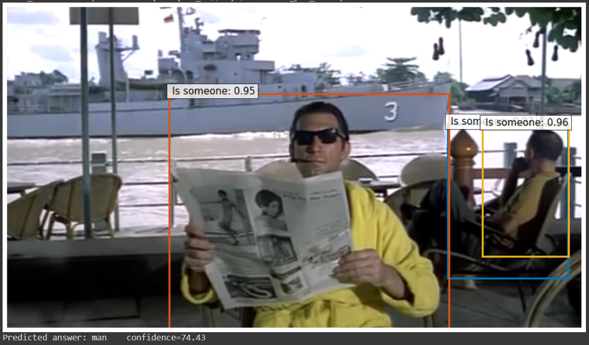
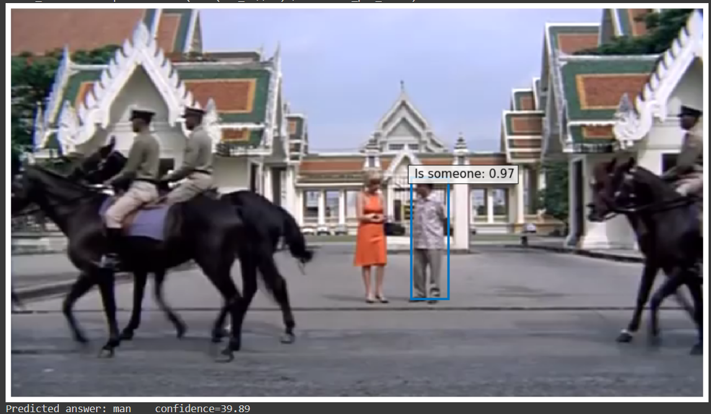
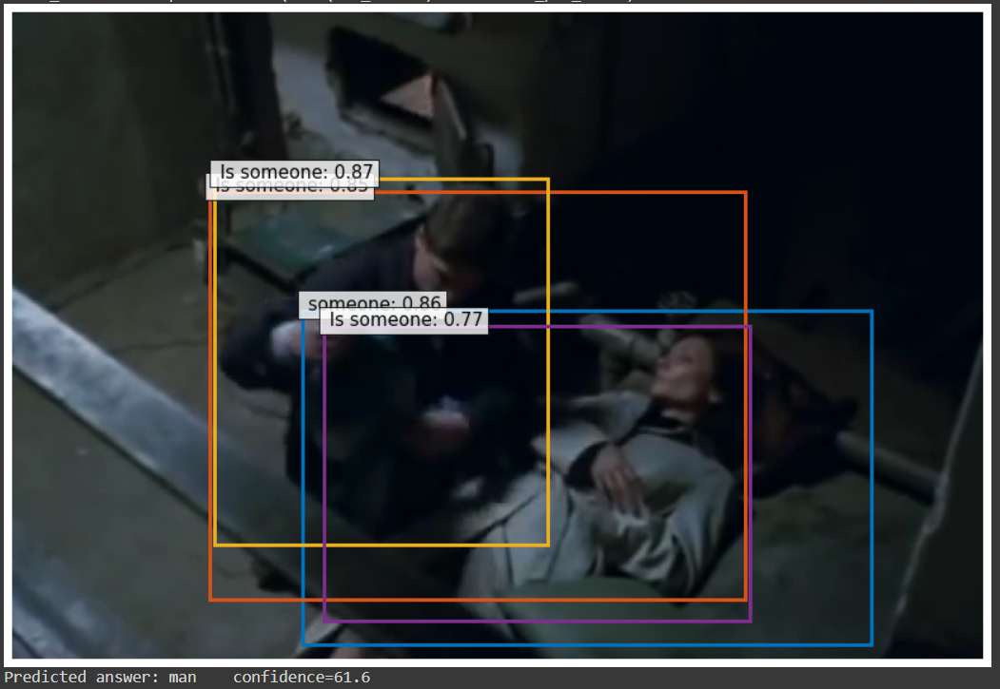
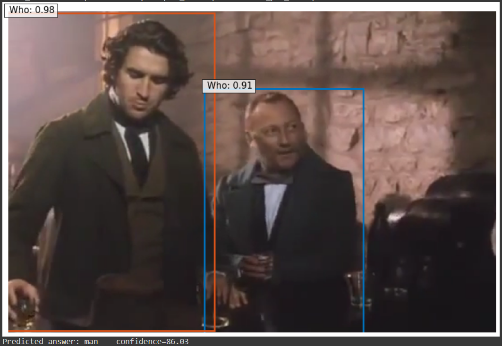
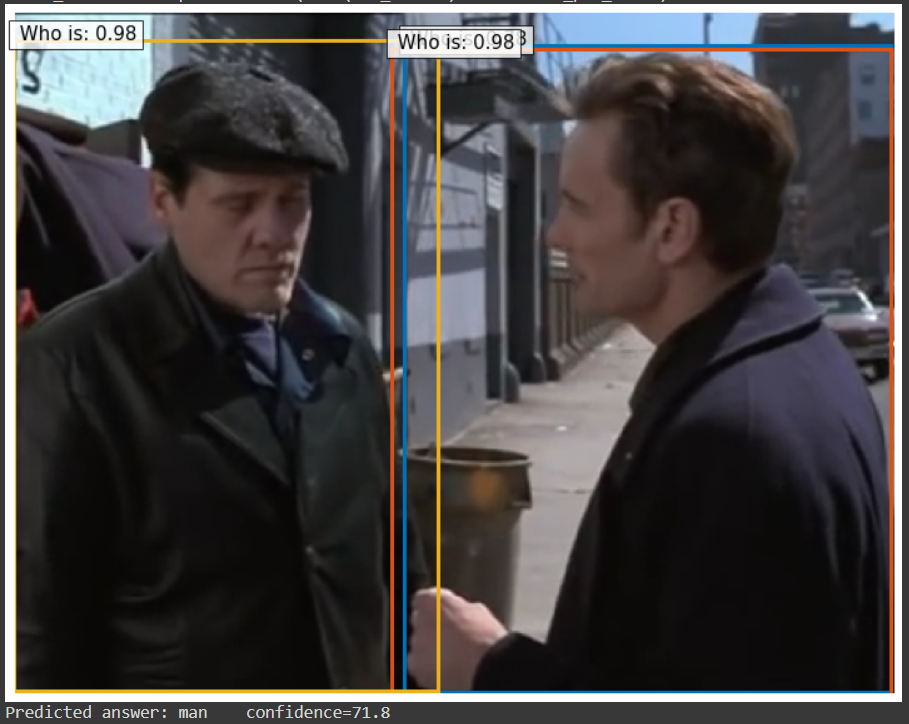

# Action Detection using MDETR
This repository contains code and link to run Atomic Visual Actions (AVA) into Modulated Detection Transformer (MDETR) for action recognition.

* Paper >> 

* Run the model >> 

## Introduction
During recent years transformers architectures have been growing in popularity. Modulated Detection Transformer (MDETR) is an end-to-end
multi-modal understanding model that performs tasks such as phase grounding, referring expression comprehension, referring expression segmentation, and
visual question answering. One remarkable aspect of the model is the capacity to infer over classes that it was not previously trained for. In this work we explore
the use of MDETR in a new task, action detection, without any previous training. We obtain quantitative results using the Atomic Visual Actions dataset.
Although the model does not report the best performance in the task, we believe that it is an interesting fiding. We show that it is possible to use a multi-modal
model to tackle a task that it was not designed for. Finally, we believe that this line of research may lead into the generalization of MDETR in additional
downstream tasks.

## Examples
Here can be seen some images processed with MDETR, and plotting to see the rectangle around object detected.
Also, you can the confidence, which is a metric that MDETR provides, to know how sure it is about the result get.
In our code, many detections are discarded because confidence is not high enough. You can change that modifying "CONFIDENCE" constante in the code.

### Success results

| Images                                                  | Images                                                                    |
| :----------:                                            | :----------:                                                              |
|             |                           |
|   |         |
|           |                                                                           |

### Failure results

As it can be seem, in some cases MDETR recognized succesfully actions, but in others, it failed. That was expected, because model was not trained
specifically for this dataset, images in AVA are difficult to process and MDETR was not thought to work with actions. All this factors causes that
model fails to recognized some situations in images.

## Results
After running validation dataset of AVA, we get some results. There were actions easily recognized, and others that not.

| | Pascal Boxes | Category Results  ||
| :----------:  | :----------:  | :----------:      | :----------:  |
| Category      | AP@0.5IOU     | Category          | AP@0.5IOU     |
| Sleep         | 0.0019        | answer phone      | 0.0           |
| Sit           | 0.0016        | kiss (a person)   | 0.0           |   
| Stand Up      | 0.0011        | throw             | 0.0           |
| Handshake     | 0.0005        | touch (an object) | 0.0           |
| Dance         | 0.0005        | touch (an object) | 0.0           |

